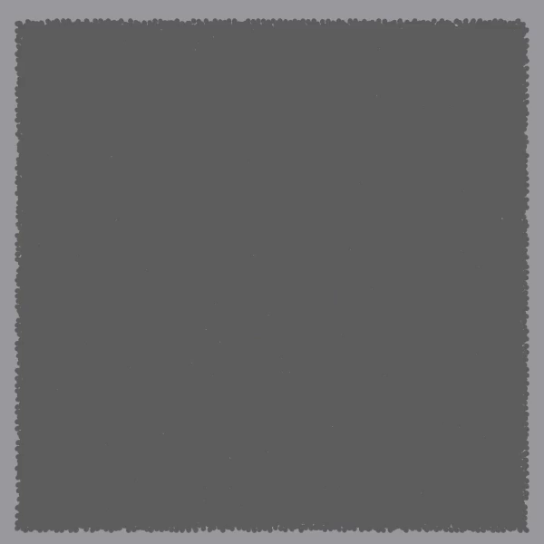
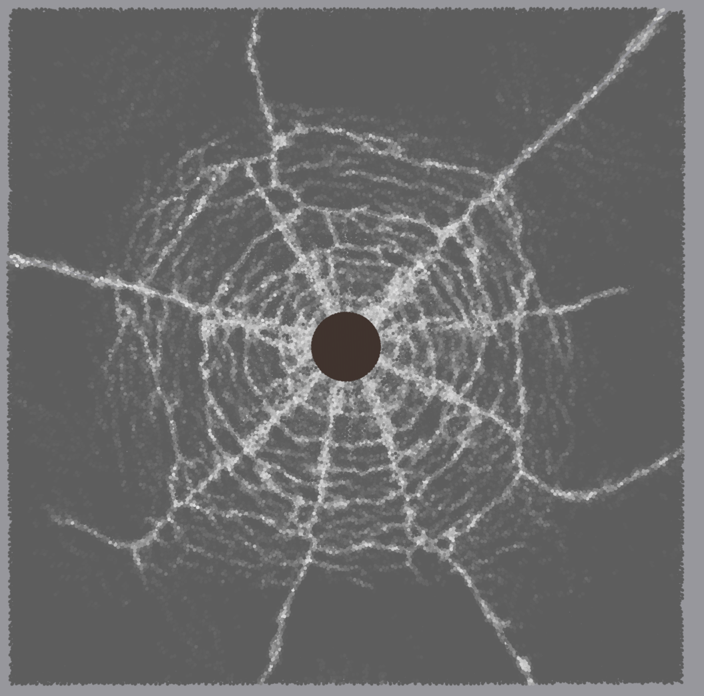
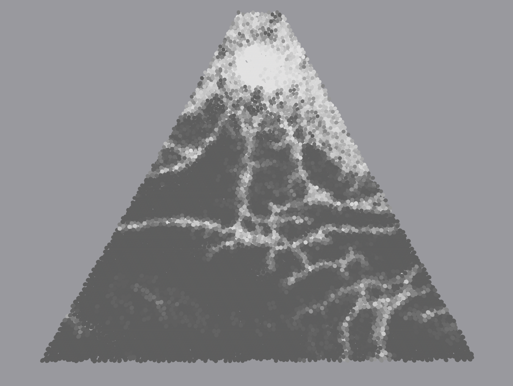
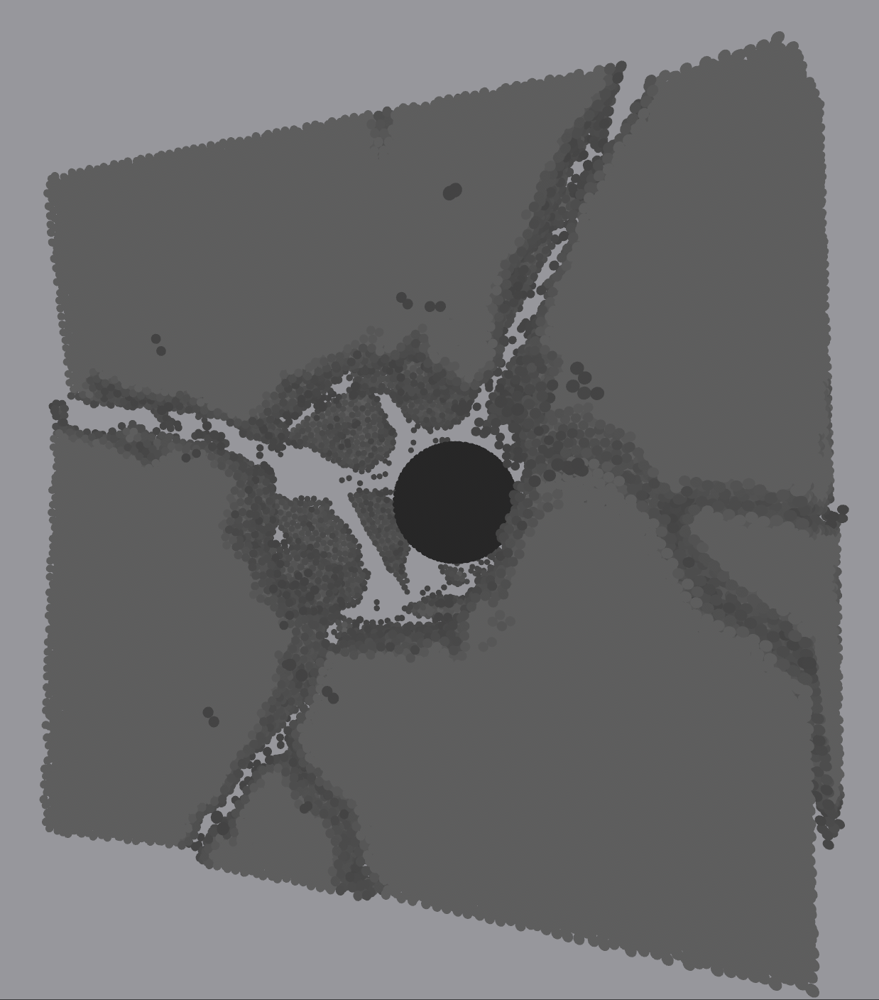
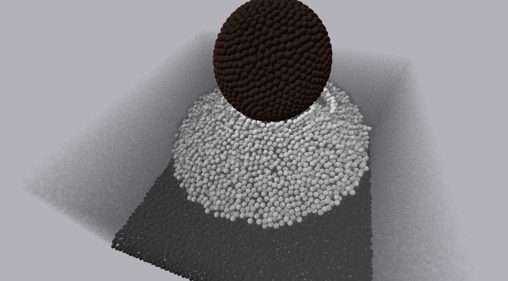
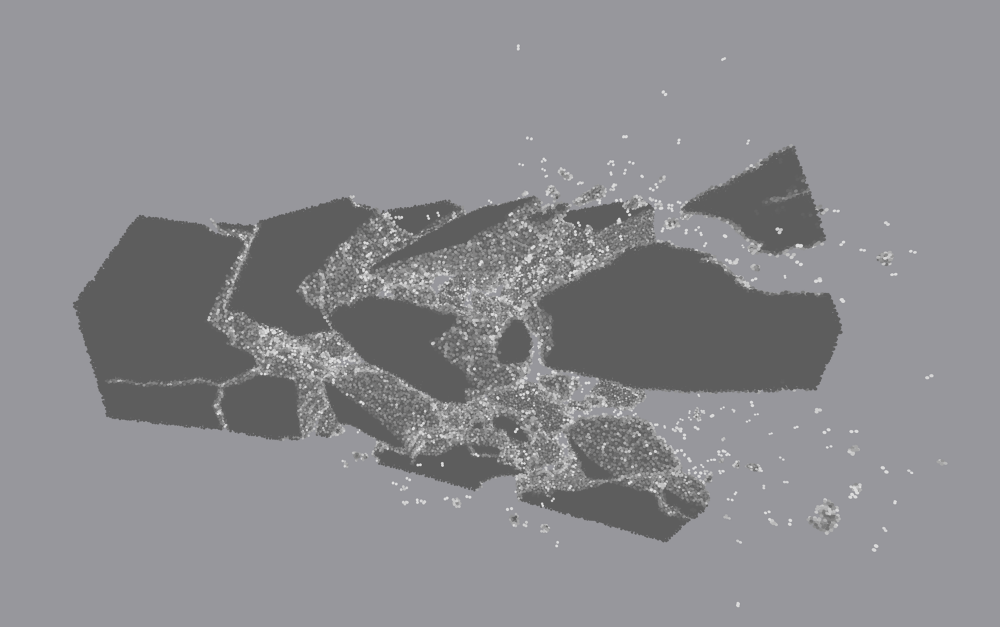

# Morningstar: Fast Dynamic Fracture using PB-RBDEM

This repository contains a GPU implementation of real time dynamic fracture using [Rod-Bonded Discrete Element Method](http://ren-bo.net/papers/zkr_gmod2024.pdf) and Position Based Dynamics (see [Primal/Dual Descent Methods for Dynamics](https://mmacklin.com/primaldual.pdf)). There is an unoptimized version of the Cosserat bond model available at [entropylost/primal_dual](https://github.com/entropylost/primal_dual).

## Installation

Install [Rust](https://www.rust-lang.org/tools/install), clone this repository, and then execute `cargo build --release`. Note that this currently uses CUDA and so will fail on any machines without a dedicated NVIDIA gpu.

## Usage

To launch the program, execute `cargo r --release scenes/glassbreak-3.scene`. When running, the keys `WASD[Space][Shift]` can be used to move the camera, and the mouse will rotate the camera, togglable via `[Esc]`. The key `\` will toggle the controls display, and `[Enter]` will run/pause the simulation.

The files use the [Rusty Object Notation](https://github.com/ron-rs/ron) (RON) serialization format, with files ending in the `.scene` extension used to describe loadable scenes, and `.pts` to describe sets of points which can be referenced by objects in the scenes. The parameters used for the objects and constants can be seen in [`src/data.rs`](src/data.rs), as well as the default values. [`src/bin/generate.rs`](src/bin/generate.rs) also shows an example program that can be used to generate a `.pts` file.

## Gallery

<table align="center">
    <tr>
        <td align="center"><a href="scenes/glassbreak-3.scene"><code>glassbreak-3</code></a> (see <a href="images/glassbreak-3-fracture.png">still</a>)</td>
        <td align="center"><a href="scenes/rigid-collide-4.scene"><code>rigid-collide-4</code></a> (side)</td>
        <td align="center"><a href="scenes/glassbreak-large.scene"><code>glassbreak-large</code></a> (front)</td>
    </tr>
    <tr>
        <td align="center"><a href="scenes/prism.scene">The Illumaniti</a></td>
        <td align="center"><a href="scenes/rigid-collide-4.scene"><code>rigid-collide-4</code></a> (front)</td>
        <td align="center"><a href="scenes/glassbreak-large.scene"><code>glassbreak-large</code></a> (back)</td>
    </tr>
    <tr>
        <td align="center"><a href="scenes/glassbreak-3.scene"><code>glassbreak-3</code></a> using <a href="https://github.com/entropylost/morningstar/tree/render">the alternate renderer</a></td>
        <td align="center"><a href="scenes/tablecrush.scene"><code>tablecrush</code></a> making a Hertzian cone</td>
        <td align="center"><a href="scenes/tablecrush.scene">Ball hitting a 200 by 60 by 60 block</td>
    </tr>
    <tr>
        <td colspan="3" align="center"><a href="scenes/glassbreak-wide.scene"><code>glassbreak-wide</code></a></td>
    </tr>
</table>
