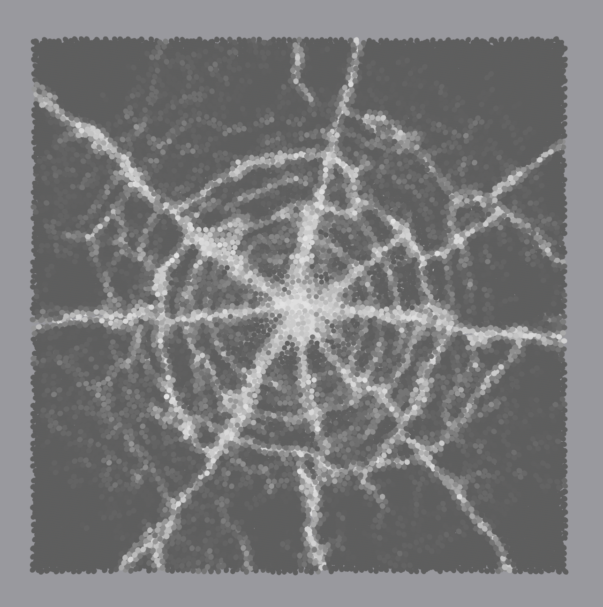
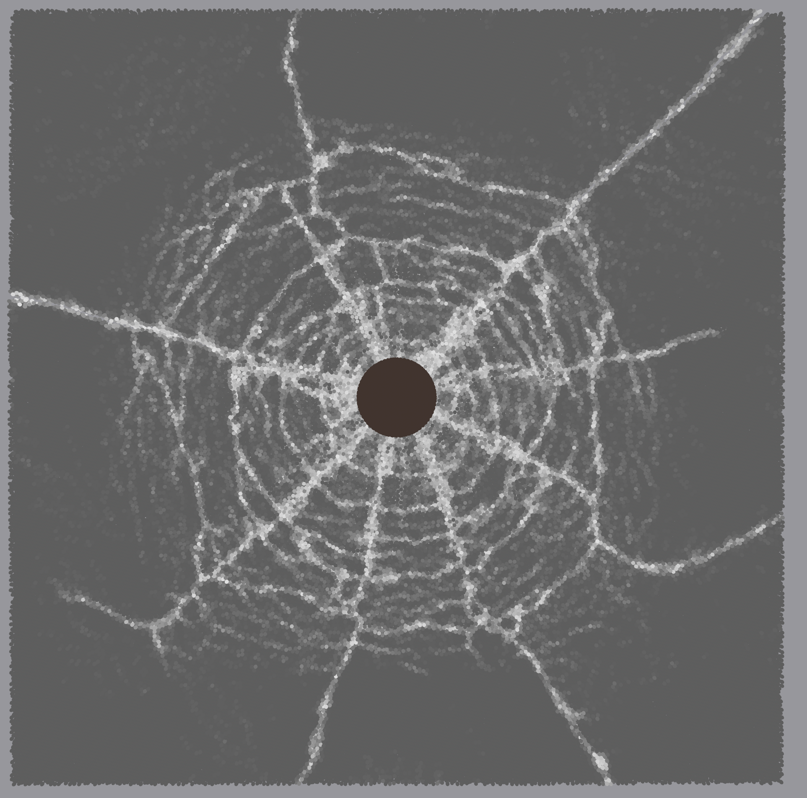
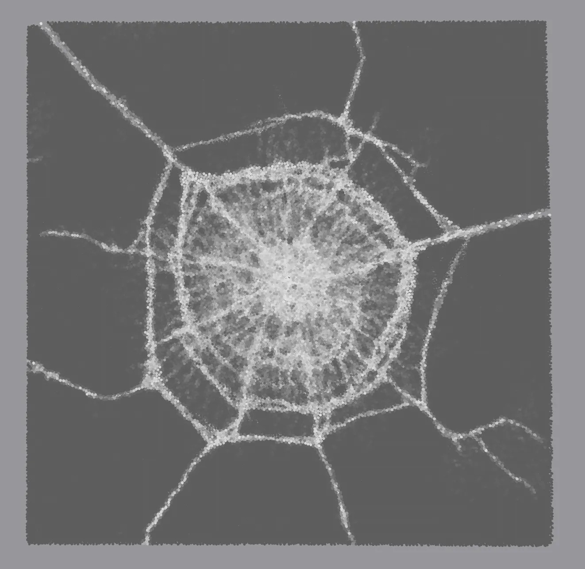
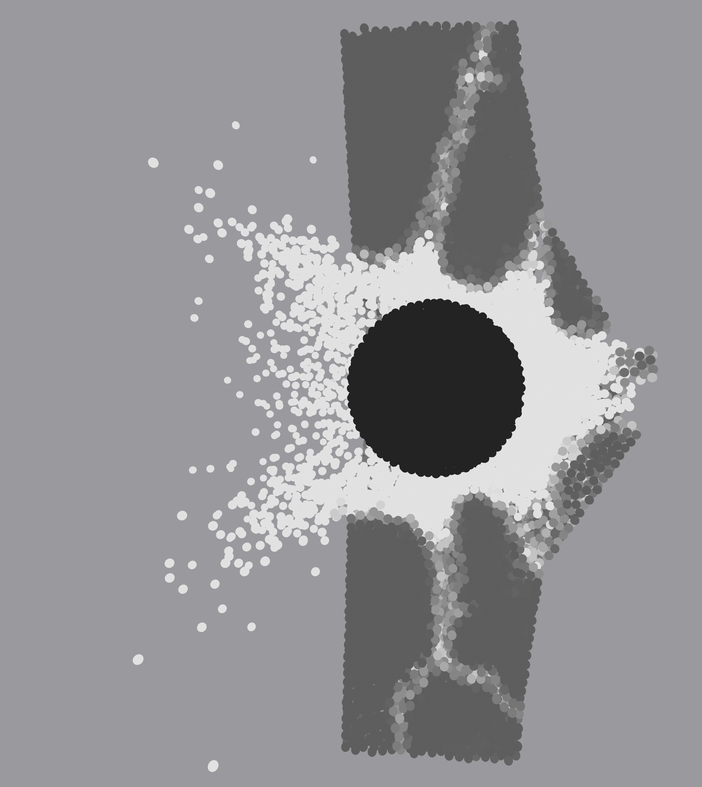
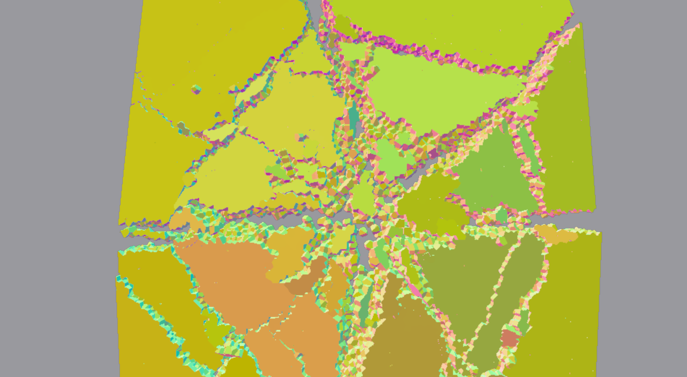
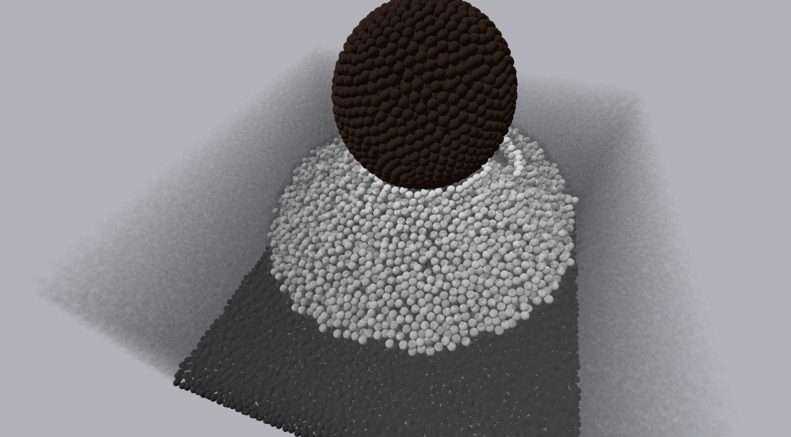
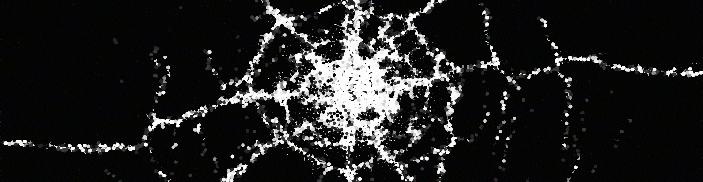

# Morningstar: Fast Dynamic Fracture using PB-RBDEM

This repository contains a GPU implementation of real time dynamic fracture using [Rod-Bonded Discrete Element Method](http://ren-bo.net/papers/zkr_gmod2024.pdf) and Position Based Dynamics (see [Primal/Dual Descent Methods for Dynamics](https://mmacklin.com/primaldual.pdf)). There is an unoptimized version of the Cosserat bond model available at [entropylost/primal_dual](https://github.com/entropylost/primal_dual).

## Installation

Install [Rust](https://www.rust-lang.org/tools/install), clone this repository, and then execute `cargo build --release`. Note that this currently uses CUDA and so will fail on any machines without a dedicated NVIDIA gpu.

## Usage

To launch the program, execute `cargo r --release scenes/glassbreak-3.scene`. When running, the keys `WASD[Space][Shift]` can be used to move the camera, and the mouse will rotate the camera, togglable via `[Esc]`. The key `\` will toggle the controls display, and `[Enter]` will run/pause the simulation.

The files use the [rusty object notation](https://github.com/ron-rs/ron) (ron) serialization format, with the `.scene` extension used to describe loadable scenes, and `.pts` to describe sets of points which can be referenced by objects in the scene files. The parameters used for the objects and constants can be seen in [`src/data.rs`](src/data.rs), as well as the default values.

## Gallery

<table align="center">
    <tr>
        <td align="center"></td>
        <td align="center">"></td>
        <td align="center">"></td>
    </tr>
    <tr>
        <td align="center"></td>
        <td align="center"></td>
        <td align="center"></td>
    </tr>
    <tr>
    <td colspan="3" align="center"></td>
    </tr>
</table>
